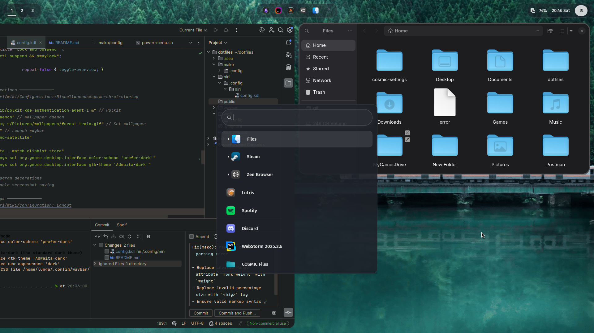

Lunga's Dotfiles — polished Wayland configuration
===============================================

This repository contains a curated, production-ready Wayland configuration for
Arch-based systems (tested on CachyOS). The goal is a clean, keyboard-first
workflow with modern UI polish and predictable, easy-to-revert installation.



Design intent
-------------
- Minimal visual clutter with a focus on meaningful defaults.
- Keyboard-driven workflows using Niri's scrollable tiling model.
- Modular, stow-friendly layout so you can enable only the packages you want.

Core components (what this repo provides)
----------------------------------------
- Niri — compositor configuration (layouts, keybindings, startup programs)
- Waybar — status bar modules and styling (battery, network, media)
- Wofi — application launcher theme and layout
- Mako — notifications styling and rules
- Alacritty — terminal configuration (via stowed config)
- Wallpapers and small theme assets under `public/`

This repository does not bundle large binary packages — it provides
configuration files, service units, and small assets referenced by those
configs. The installer (`install.sh`) will suggest and install system packages
needed to run the configuration.

Prerequisites
-------------
- Arch Linux or an Arch-based distro (CachyOS recommended/tested).
- A user account with sudo privileges to install packages and enable services.
- `git` and `stow` available to manage symlinks (the installer will install
  them if missing, but you can choose to run stow manually).

High-level install steps (what happens when you run `./install.sh`)
-----------------------------------------------------------------
1) Sanity check: the script verifies it is running on an Arch system by
   checking `/etc/arch-release` and aborts early with a clear message if not.
2) System update: the script runs `sudo pacman -Syu` to ensure packages are
   up to date. (You may opt to skip this step by editing the script or running
   it manually.)
3) Install official packages: a curated list of packages required by the
   configurations is installed via `pacman -S --needed`. This includes core
   utilities, Wayland components and fonts.
4) Install AUR packages: a small set of user-supplied packages is installed
   via `yay` (AUR helper). The script will clone and build `yay` if it is not
   present.
5) Stow configurations: configuration packages (each folder at repo root)
   are symlinked into `~/.config/<package>` using `stow -R`.
   - Before stowing, any existing non-symlinked directory is moved to
     `<target>.bak` (e.g., `~/.config/waybar` -> `~/.config/waybar.bak`). This
     preserves your previous config and makes rollback trivial.
6) Enable services: the script enables or starts required services (example:
   `bluetooth`) with `systemctl`.
7) Final notes: the script creates `~/Pictures/wallpapers` and places a note
   for wallpapers you may want to add manually.

What the installer will try to install (summary)
-----------------------------------------------
- Official repo packages (examples): `niri`, `waybar`, `mako`, `wofi`,
  `alacritty`, `nautilus`, `swww`, `stow`, `git`, `base-devel`, fonts.
- AUR packages (examples): `overskride`, `swww` (if not in repo),
  `xwayland-satellite`, `aylurs-gtk-shell`, `zen-browser-bin`.

These lists are declared inside `install.sh` (OFFICIAL_PACKAGES and
AUR_PACKAGES). Edit the arrays if you want to add, remove, or pin package
choices before running the installer.

Safety & rollback
-----------------
- The installer backs up existing configuration directories by renaming them
  to `<target>.bak` before creating symlinks. To roll back a stow, you can
  restore a backup and remove the symlinked directory.

  Example restore:

  ```bash
  mv ~/.config/waybar.bak ~/.config/waybar
  stow -D waybar
  ```

- The script uses `sudo` for privileged operations. If you prefer to control
  package installation yourself, run the script only after removing or
  commenting-out the pacman/yay sections.

Dry-run and validation (recommended before applying)
---------------------------------------------------
- Preview what stow will do without changing anything:

  ```bash
  cd ~/dotfiles
  stow -n -v <package>
  ```

- Lint and format shell scripts:

  ```bash
  shellcheck install.sh
  shfmt -w -i 4 -ci install.sh
  ```

Customization & modular usage
-----------------------------
- Each top-level directory is a stow package. You do not have to enable all
  packages. To apply a single package:

  ```bash
  cd ~/dotfiles
  stow -R waybar
  ```

- To remove a stowed package (unlink the files):

  ```bash
  stow -D waybar
  ```

Security & secrets
------------------
- Do not commit secrets (API keys, private keys, passwords) into this
  repository. If a configuration requires credentials, store them in
  `~/.local` or an environment file referenced in your shell profile and add
  the file to `.gitignore`.

Troubleshooting
---------------
- If Wayland session fails to start or a bar/module errors, check the
  corresponding log files and run the programs manually to reproduce the
  error. Waybar can be run with `WAYBAR_LOG=trace waybar --config ...` for
  more verbose output.
- If stow reports permission errors, ensure the target directories are owned
  by your user and not accidentally root-owned (this can happen if you ran
  the stow command with sudo previously).

Contributing
------------
- Add new packages as new top-level directories and document their purpose.
- Keep changes small: update the relevant package directory and add a note in
  README or the package-specific README explaining required dependencies.

Glossary (short)
-----------------
- Stow: a symlink manager that maps files from the dotfiles repository into
  `~/.config` or home directories, enabling easy enable/disable of packages.
- Niri: compositor configuration used to manage tiling and window behavior.

Contact
-------
If you use or adapt this repository, open an issue or send a pull request with
your changes and rationale. Keep changes small and include rollback steps.

License
-------
Distributed under the MIT License. See [LICENSE](LICENSE) for more information.
