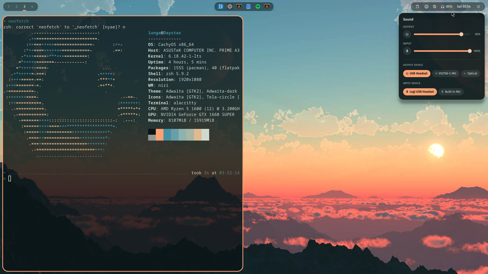
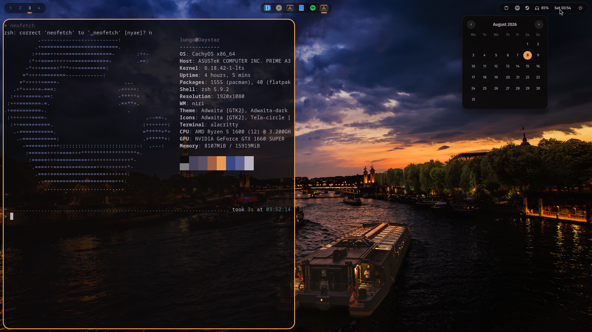
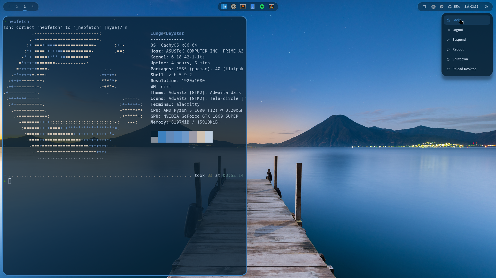

<p align="center">
  
</p>

<p align="center">
  <strong>A gentle, glossy Wayland desktop for Arch.</strong><br>
  Built on Niri and Quickshell, themed by your wallpaper.
</p>

<p align="center">
  
  
  
</p>

---

## Why Manatee?

Manatees are gentle giants: calm, deliberate, and perfectly at home in their
environment. Your desktop should feel the same.

- **Gentle on your system**: Niri's scrollable tiling keeps everything flowing
  without the jank. One workspace scrolls into the next. No reshuffling, no
  surprises.
- **Glossy out of the box**: Quickshell bar, notification center, app launcher,
  lock screen, and SDDM greeter: all themed together. Looks good from the moment
  you log in.
- **Grows with your wallpaper**: pywal pulls a full palette from any image.
  Every surface: bar, notifications, terminal, GTK apps, even the login screen
  follows along. Drop a new wallpaper, everything shifts to match.

## Quick Start

```bash
git clone https://github.com/Lunga93/manatee-desktop.git
cd manatee-desktop
./install.sh
```

Log out. Log back in with Niri. That's it: you're in the pod.

> **Arch-based distros only.** Tested on CachyOS. The installer checks
> `/etc/arch-release` and will bail politely if it's not there.

See `./install.sh --help` for dry-run and update options.

## What's in the box

| Component   | What it does                                      | Keybinding       |
|-------------|---------------------------------------------------|------------------|
| **Niri**    | Scrollable-tiling compositor. Workspaces scroll vertically, columns horizontally. | `Mod+Shift+H/L`  |
| **Quickshell** | Bar with workspaces, taskbar, tray, clock, power. Floating popouts for audio and calendar. | `Mod+,` for Settings |
| **Wofi**    | Fuzzy app launcher. Type to find.                 | `Mod+Space`      |
| **swaync**  | Notification daemon with slide-out control center. | `Mod+N`          |
| **Alacritty** | GPU-accelerated terminal.                      | `Mod+Return`     |
| **SDDM**    | Login greeter themed to match your desktop.       |:                |

Plus: fastfetch system info, daily wallpaper rotation, Bluetooth and audio
controls, clipboard history, and a first-run welcome wizard.

## Gallery

<p align="center">
  
  
  
</p>

## Theming

Manatee is theme-native. Drop a wallpaper into `~/Pictures/wallpapers/` and
`apply-theme` regenerates every color surface:

```
wallpaper → pywal → colors.json
                        ├── Alacritty (terminal colors)
                        ├── swaync (notification colors)
                        ├── Wofi (launcher colors)
                        ├── GTK3/4 (app colors)
                        ├── Niri (focus rings)
                        ├── SDDM (login screen)
                        └── Quickshell (bar + popouts)
```

Use `Mod+Shift+W` to pick a new wallpaper and retheme instantly.

## Contributing

Found a rough edge? Have an idea? Open an issue or PR. Manatee is a personal
desktop that grew into something worth sharing: contributions that keep it
gentle and glossy are welcome.

## Join the pod

- **Repo:** [github.com/Lunga93/manatee-desktop](https://github.com/Lunga93/manatee-desktop)
- **Issues:** [open an issue](https://github.com/Lunga93/manatee-desktop/issues)

---

<p align="center">
  <sub>🐋 Manatee Desktop: gentle by nature, glossy by design.</sub>
</p>
