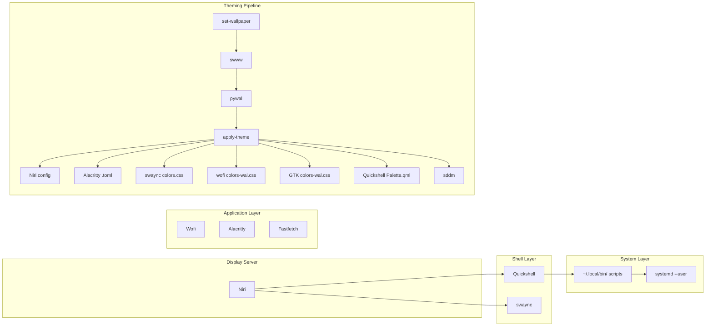
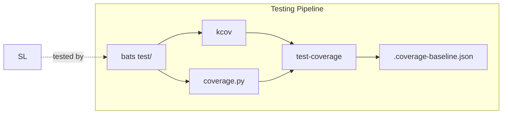
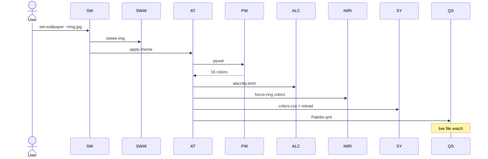
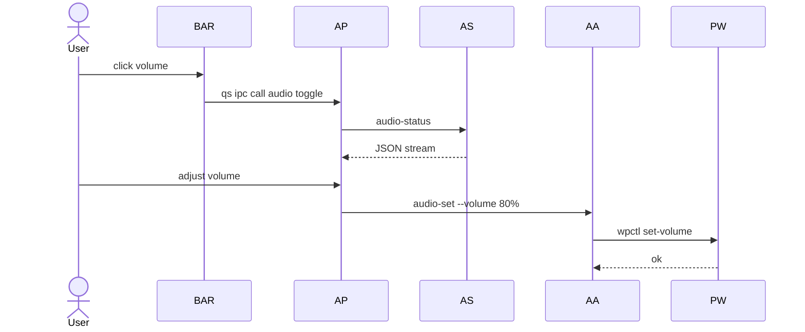

# Architecture

> [!WARNING] Living document — update when data flows or components change.

## Layer Diagram



## Testing Pipeline



## Data Flow: Theming



## Data Flow: Audio



## Stow Layout

Each package mirrors target path:

```
quickshell/.config/quickshell/Bar.qml  →  ~/.config/quickshell/Bar.qml
scripts/.local/bin/audio-status         →  ~/.local/bin/audio-status
```

> [!NOTE] Run `stow -n -v <pkg>` to dry-run, `stow -R <pkg>` to apply.

## File Conventions

| Purpose | Path | Managed by |
|---------|------|-----------|
| Autostart .desktop | `~/.config/autostart/` | Niri spawn |
| State files | `~/.local/state/` | Scripts |
| Cache | `~/.cache/` | pywal, scripts |
| systemd user | `~/.config/systemd/user/` | stow |
| SDDM theme sync | `/var/lib/sddm-theme/` | apply-theme |
| Coverage baseline | `test/.coverage-baseline.json` | test-coverage |

---

**Next:** [[Packages Reference]] | [[Testing Standards]]
