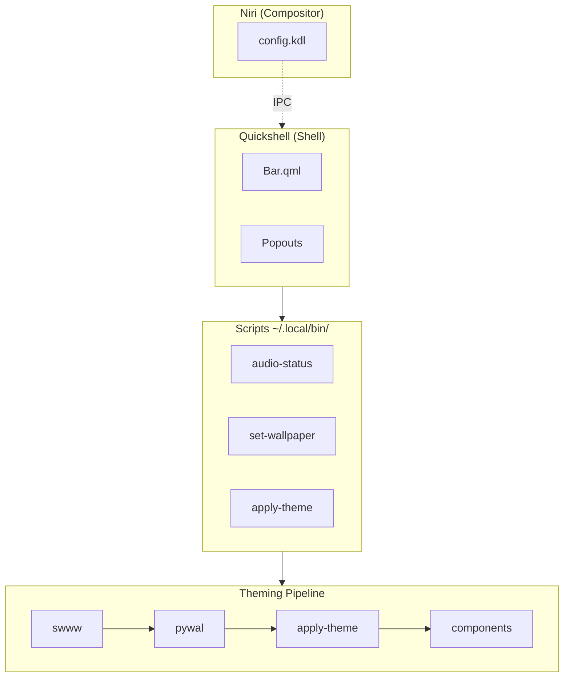

# Home

Welcome, developer. This vault documents the architecture, conventions, and workflows for the Manatee dotfiles.

> [!TIP] New here? Start with [[Quickstart]] to get set up.

## Quick Links

| Goal | Start here |
|------|-----------|
| Big picture | [[Architecture]] |
| Where packages live | [[Packages Reference]] |
| Code style | [[Patterns & Standards]] |
| Add a feature | [[Workflows]] |
| New dev setup | [[Quickstart]] |

## System Overview



## Package Inventory

Active packages: [[Packages/Niri|Niri]], [[Packages/Quickshell|Quickshell]], [[Packages/Swaync|Swaync]], [[Packages/Wofi|Wofi]], [[Packages/Alacritty|Alacritty]], [[Packages/GTK|GTK]], [[Packages/Scripts|Scripts]], [[Packages/Systemd|Systemd]], [[Packages/SDDM|SDDM]], [[Packages/Fastfetch|Fastfetch]], [[Packages/Welcome|Welcome]]

Archived: [[Packages/AGS|AGS]], [[Packages/Waybar|Waybar]] (both replaced by Quickshell)

## Vault Markup Reference

| Feature | Syntax |
|---------|--------|
| Callout | `> [!NOTE]` / `> [!WARNING]` / `> [!TIP]` |
| Collapsible | `> [!FAQ]- Title` |
| Mermaid | ` ```mermaid ` ... ` ``` ` |
| Code | ` ```bash ` / ` ```qml ` / ` ```json ` |
| Links | `[[Page]]` or `[[Page|Display]]` |

---

**Next:** [[Architecture]]
