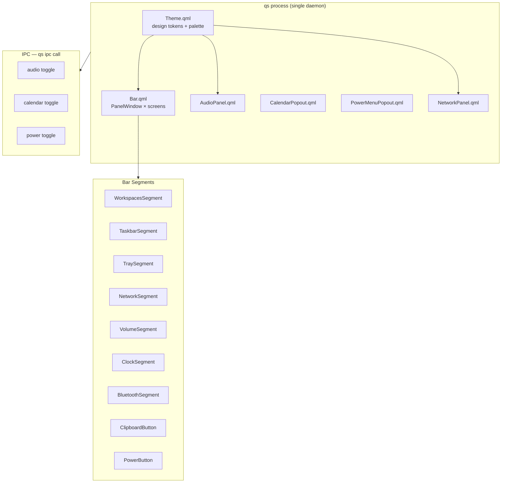
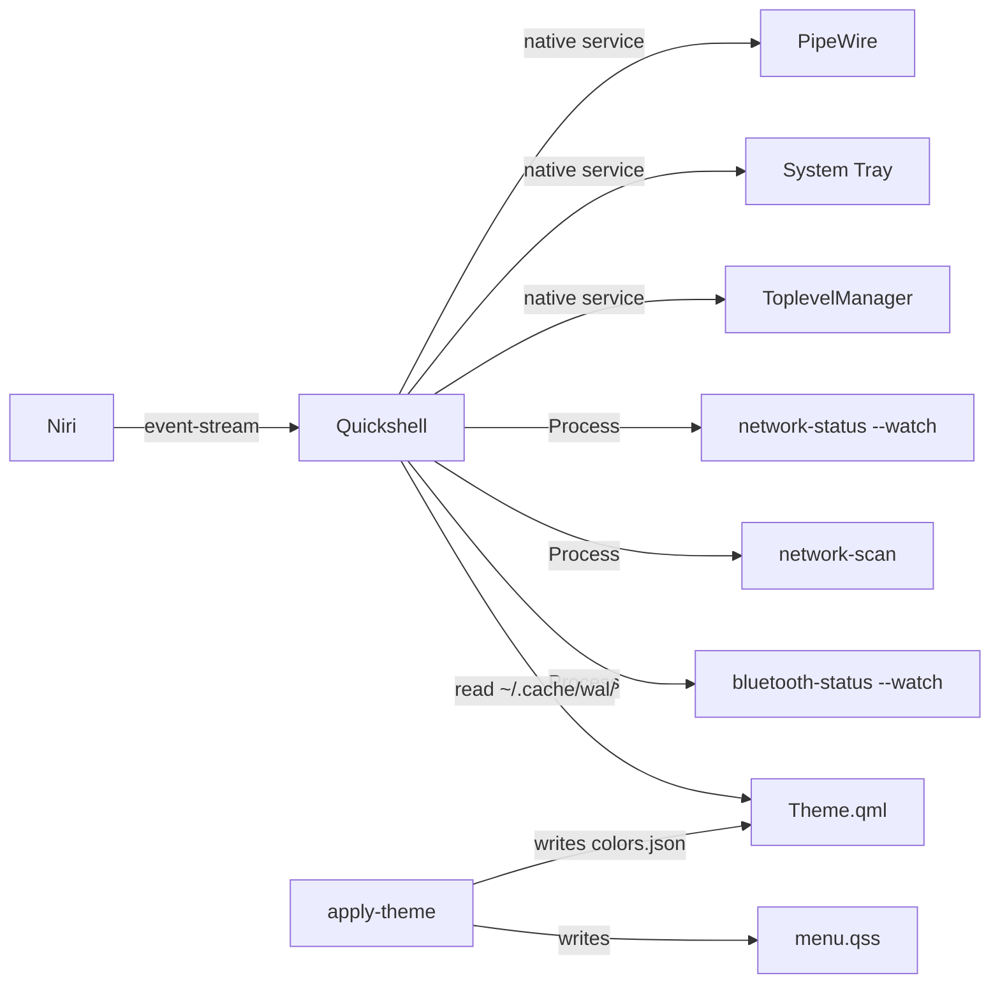
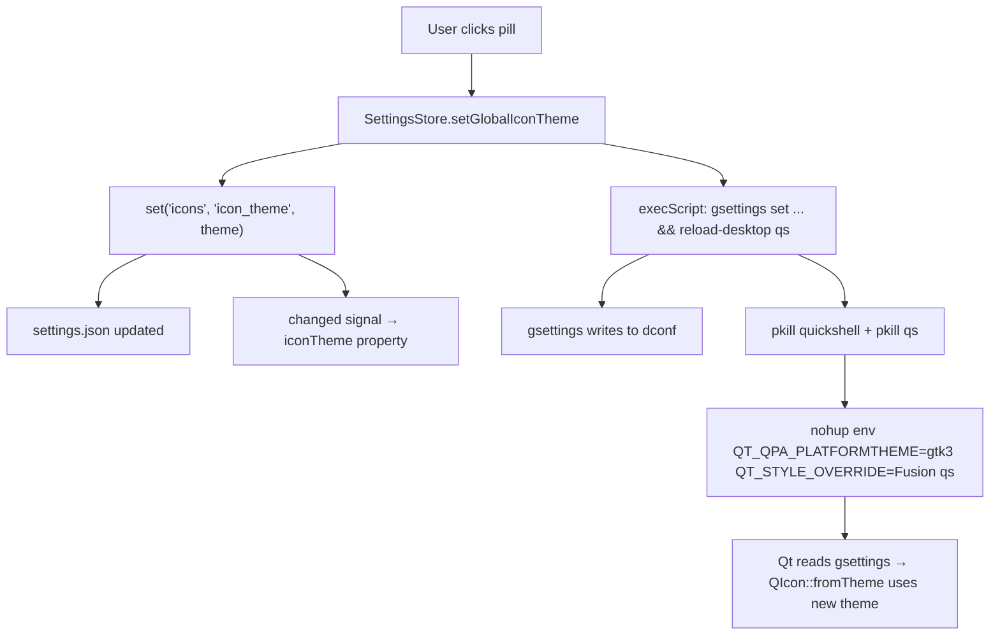

# Quickshell

Qt6/QML shell daemon — the heart of the desktop UI.

> [!NOTE] Quickshell is a single `qs` process that renders multiple windows (one bar per screen + popouts). It replaces the old Waybar and AGS configurations.

## Location

`quickshell/.config/quickshell/` → `~/.config/quickshell/`

## Architecture



## Key Files

| File | Purpose |
|---|---|
| `Bar.qml` | Main bar — 3-pill layout (left/center/right), one per screen via `Variants { model: Quickshell.screens }` |
| `Theme.qml` | Design system + live palette singleton. Reads `~/.cache/wal/colors.json` via `FileView` watcher and re-emits all tokens on wallpaper change — no `qs` restart needed. **Tracked in repo** |
| `shell.qml` | Entrypoint — instantiates Bar per screen, popouts, and wires them to `Globals` singleton |
| `Globals.qml` | Shared references for popout toggle with single-popout-at-a-time UX |
| `NetworkPanel.qml` | Network control panel — wifi toggle, scan, connect/disconnect, networking toggle, settings link |
| `NetworkSegment.qml` | Bar wifi/ethernet status icon — click toggles `NetworkPanel` |

### Bar Segments

| File | Data source | Purpose |
|---|---|---|
| `WorkspacesSegment.qml` | `niri msg --json event-stream` | Niri workspace list |
| `TaskbarSegment.qml` | `Quickshell.Wayland.ToplevelManager` | Open window list |
| `TraySegment.qml` | `Quickshell.Services.SystemTray` | System tray icons — filters `nm-applet` (duplicate wifi icon); tinted `Theme.textPrimary` idle, `Theme.accent` on hover/press via `MultiEffect` colorization |
| `NetworkSegment.qml` | `network-status --watch` via `Process` | WiFi/Ethernet status icon — click toggles NetworkPanel |
| `VolumeSegment.qml` | `Quickshell.Services.Pipewire` | Volume icon + popout toggle |
| `ClockSegment.qml` | `Date` JS object | Date/time |
| `BluetoothSegment.qml` | `bluetooth-status --watch` via `Process` | BT status icon, hides when no adapter present |
| `ClipboardButton.qml` | `cliphist` | Clipboard indicator |
| `PowerButton.qml` | N/A | Power menu toggle |

### Popouts

| File | Toggle | Purpose |
|---|---|---|
| `AudioPanel.qml` | `qs ipc call audio toggle` | Volume sliders + device selector |
| `CalendarPopout.qml` | `qs ipc call calendar toggle` | Calendar widget |
| `PowerMenuPopout.qml` | `qs ipc call power toggle` | Shutdown/reboot/logout |
| `NetworkPanel.qml` | `Globals.toggle(Globals.networkPanel)` | WiFi toggle, network scan & connect, disconnect, networking toggle, settings link |

## Integration Points



> [!FAQ]- **How segments consume data**
>
> Each segment gets its data differently:
> - **PipeWire-based** (VolumeSegment): binds directly to `Quickshell.Services.Pipewire` — no script needed
> - **Script-based** (BluetoothSegment): spawns `bluetooth-status --watch` via `Process` with `SplitParser` for JSON streaming
> - **Niri IPC** (WorkspacesSegment): subscribes to `niri msg --json event-stream` via Process
> - **Wayland protocol** (TraySegment, TaskbarSegment): native Quickshell services

## IPC Protocol

Toggle popouts from anywhere:

```bash
qs ipc call audio toggle      # Audio panel
qs ipc call calendar toggle    # Calendar
qs ipc call power toggle       # Power menu
```

These can be bound to Niri keybindings in `config.kdl`:

```kdl
binds {
    Mod+AudioRaiseVolume { spawn ["qs", "ipc", "call", "audio", "toggle"]; }
}
```

## Conventions

- 4-space indent in QML
- Design tokens in `Theme.qml` — never hardcoded in components
- `Theme.qml` reads pywal's `colors.json` via `FileView` watcher — no `qs` restart needed on theme change
- Popout toggle naming: `qs ipc call <target> toggle`

## Extending

### Add a bar segment

```qml
// 1. Create YourSegment.qml — extend BarIconButton for consistent sizing
import QtQuick
import Quickshell

BarIconButton {
    id: root
    icon: "󰐊"  // Nerd Font glyph
    active: false
    tooltip: "Your Segment"

    onClicked: Globals.toggle(Globals.yourPopout)
}
```

```qml
// 2. Register in qmldir
YourSegment 1.0 YourSegment.qml
```

```qml
// 3. Add to Bar.qml right pill
YourSegment { Layout.alignment: Qt.AlignVCenter }
```

### Add a popout

```qml
// 1. Create YourPopout.qml — extend Popout for consistent card + animation
import QtQuick
import Quickshell

Popout {
    id: root
    cardWidth: 300
    padding: 16
    // ... your popout UI
}
```

```qml
// 2. Instantiate in shell.qml + wire to Globals
YourPopout { id: yourPopout }

Item {
    Component.onCompleted: {
        Globals.yourPopout = yourPopout;
    }
}
```

```qml
// 3. Add to Globals.qml _allPopouts() for single-popout UX
property var yourPopout: null
```

## Settings App

The settings app is a full-window configuration panel inside the `qs` daemon. It opens via `MOD+,` or `qs ipc call settings toggle`.

### Pages (all active as of Beta)

| Index | Category | Page file | Key file | Live data? |
|-------|----------|-----------|----------|------------|
| 0 | Wallpaper | `pages/wallpaper/WallpaperPage.qml` | `components/`, `data/` | Yes (pywal, mood cache) |
| 1 | Appearance | `pages/top-bar/TopBarPage.qml` | `TopBarPreview.qml` | Yes (live preview) |
| 2 | Icons | `pages/icons/IconsPage.qml` | — | Yes (theme scan) |
| 3 | Display | `pages/display/DisplayPage.qml` | — | No (writer only) |
| 4 | Keybindings | `pages/keybindings/KeybindingsPage.qml` | `KeyCaptureDialog.qml`, `data/KeybindingsStore.qml` | Yes (niri-keybind) |
| 5 | Network | `pages/network/NetworkPage.qml` | — | Yes (nmcli) |
| 6 | Sound | `pages/sound/SoundPage.qml` | — | Yes (wpctl) |
| 7 | System Info | `pages/sysinfo/SysInfoPage.qml` | — | Yes (read-only) |

### Shared Components

| Component | Purpose |
|-----------|---------|
| `PillSelector.qml` | Pill-based option selector. Defaults to single-line `Row` via `Loader`. Set `wrap: true` + `width: parent.width` to switch to `Flow` layout for many options. `implicitWidth` auto-sizes in row mode; explicit width constrains wrapping in flow mode. |
| `LabelRow.qml` | Label + right-anchored control slot for settings rows |
| `GroupShell.qml` | Card wrapper with accent header bar |
| `VSlider.qml` | Vertical slider with `dragValue`/`dragging` state to avoid binding loops |

### Icons Page

The Icons page discovers installed icon themes at runtime and applies changes system-wide.

**Discovery flow:**

```qml
// themeScan Process — runs find over icon directories
Process {
    running: true
    command: ["sh", "-c",
        "find /usr/share/icons ~/.local/share/icons ~/.icons " +
        "-maxdepth 2 -name index.theme -not -path '*/hicolor/*' " +
        "2>/dev/null | sed 's|/index.theme||' | xargs -n1 basename | sort -u"]
    stdout: SplitParser {
        onRead: function(line) {
            // .concat() creates new array reference — critical for QML binding reactivity
            root.iconThemeKeys = root.iconThemeKeys.concat(line);
            root.iconThemeLabels = root.iconThemeLabels.concat(line);
        }
    }
}
```

> [!WARNING] Using `.push()` + reassign (`root.iconThemeKeys = names`) does NOT trigger QML bindings because the array reference is identical. Always use `.concat()` to create a new reference.

**Apply flow:**



The `reload-desktop qs` script handles kill+respawn atomically, so the theme change takes effect without manual intervention. See `Scripts.md` for the script details.

### Wallpaper Grid

The wallpaper grid shows individual images when browsing a mood category. Two critical details:

1. **Scanner Process** (`WallpaperGrid.qml`) — must have both `command:` and `running: true` set declaratively. Without `command:`, the process starts empty and `root.wallpapers` stays `[]`.

2. **Height binding** — `WallpaperPage.qml` must not override WallpaperGrid's internal height with `implicitHeight` (which is 0 for plain `Item` types). The grid's own height binding (`gridHeader.height + Math.min(wallList.height, 400) + 8`) handles show/hide correctly via `moodFilter !== ""`.

### Adding a page

1. Create `pages/<category>/<Name>Page.qml`
2. Add its entry in `SettingsContent.qml` at the matching `activeIndex`
3. Register the type in root `qmldir`
4. Update the category list in `data/Categories.qml`

### Data layer

- `data/SettingsStore.qml` — persistence singleton, reads/writes `~/.config/dotfiles/settings.json`
- `data/Categories.qml` — sidebar category definitions
- `data/KeybindingsStore.qml` — niri keybind query/rebind via `niri-keybind` script
- `data/MoodCatalog.qml` — mood taxonomy for wallpaper tagging
- `components/Toast.qml` — reusable toast notification (info/success/error)

> [!WARNING] **Docs-update discipline**: changing Quickshell's bar layout, adding/removing segments, or modifying the IPC protocol means updating this page. See `AGENTS.md` section 8.
