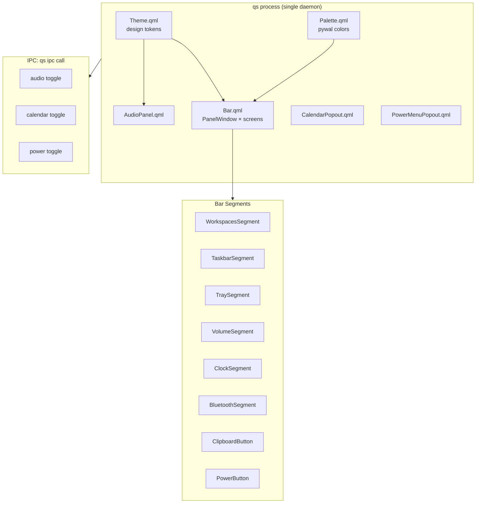
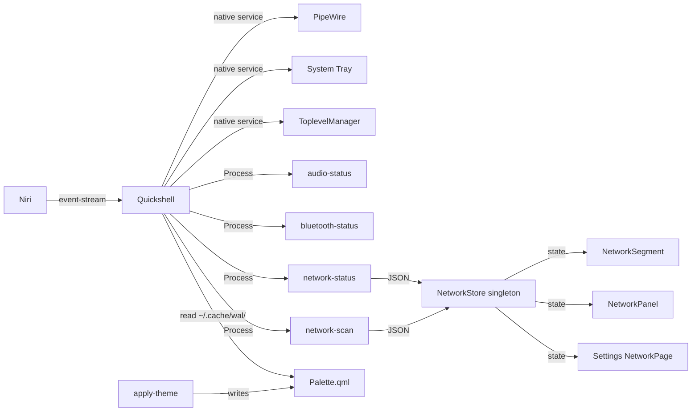

# Quickshell

Qt6/QML shell daemon: the heart of the desktop UI.

> [!NOTE] Quickshell is a single `qs` process that renders multiple windows (one bar per screen + popouts). It replaces the old Waybar and AGS configurations.

## Location

`quickshell/.config/quickshell/` → `~/.config/quickshell/`

## Architecture



## Key Files

| File | Purpose |
|---|---|
| `Bar.qml` | Main bar: 3-pill layout (left/center/right), one per screen via `Variants { model: Quickshell.screens }` |
| `BarPill.qml` | Floating glass pill: translucent bg from `SettingsStore.topBarBgOpacity`, hairline border, soft shadow |
| `BarGlowText.qml` | Chrome text: font family/weight + white glow halo from settings (`topBarFontFamily`/`topBarFontWeight`/`topBarTextGlow`); falls back to `Theme.fontFamily` if the chosen font isn't installed |
| `Theme.qml` | Design system: radii, durations, surface colors, typography. **Tracked in repo** |
| `Palette.qml` | Color palette: regenerated by `apply-theme` from pywal. **Gitignored** |
| `qmldir` | QML module registry: registers singletons and components |

### Bar Segments

| File | Data source | Purpose |
|---|---|---|
| `WorkspacesSegment.qml` | `niri msg --json event-stream` | Niri workspace list |
| `TaskbarSegment.qml` | `Quickshell.Wayland.ToplevelManager` | Open window list |
| `TraySegment.qml` | `Quickshell.Services.SystemTray` | System tray icons |
| `VolumeSegment.qml` | `Quickshell.Services.Pipewire` | Volume icon + popout toggle |
| `ClockSegment.qml` | `Date` JS object | Date/time |
| `BluetoothSegment.qml` | `bluetooth-status` script | BT status icon |
| `ClipboardButton.qml` | `cliphist` | Clipboard indicator |
| `PowerButton.qml` | N/A | Power menu toggle |

### Popouts

| File | Toggle | Purpose |
|---|---|---|
| `AudioPanel.qml` | `qs ipc call audio toggle` | Volume sliders + device selector |
| `CalendarPopout.qml` | `qs ipc call calendar toggle` | Calendar widget |
| `PowerMenuPopout.qml` | `qs ipc call power toggle` | Shutdown/reboot/logout |
| `NetworkPanel.qml` | `qs ipc call network toggle` | WiFi/Ethernet status + available networks + connect, all through the `NetworkStore` singleton. Footer opens the Settings network page |

## Integration Points



> [!FAQ]- **How segments consume data**
>
> Each segment gets its data differently:
> - **PipeWire-based** (VolumeSegment): binds directly to `Quickshell.Services.Pipewire`: no script needed
> - **Script-based** (BluetoothSegment): spawns `bluetooth-status --watch` via `Process` with `SplitParser` for JSON streaming
> - **Niri IPC** (WorkspacesSegment): subscribes to `niri msg --json event-stream` via Process
> - **Wayland protocol** (TraySegment, TaskbarSegment): native Quickshell services
> - **NetworkStore singleton** (NetworkSegment, NetworkPanel, Settings NetworkPage): a single `network-status --watch` `Process` in `settings/data/NetworkStore.qml` streams state to all three views; scans and nmcli actions are also multiplexed there (one watcher, not one per view)

## IPC Protocol

Toggle popouts from anywhere:

```bash
qs ipc call audio toggle      # Audio panel
qs ipc call calendar toggle    # Calendar
qs ipc call power toggle       # Power menu
qs ipc call network toggle     # Network panel
```

These can be bound to Niri keybindings in `config.kdl`:

```kdl
binds {
    Mod+AudioRaiseVolume { spawn ["qs", "ipc", "call", "audio", "toggle"]; }
}
```

## Dark / Light Mode

Toggle in Settings → Display page. Writes `appearance.color_scheme` to `settings.json`.

**Propagation:**
```
Settings toggle → set("appearance", "color_scheme", "dark"|"light")
  → apply-theme runs (wal -l for light, gsettings color-scheme set)
  → scheme injected into ~/.cache/wal/colors.json
  → Theme.qml FileView detects change → isDark flips
  → surfaceElev/Hover/Pressed/Border flip via surfaceOverlay()
  → settings window colors (surfaceWindow, textHeader, etc.) adapt
```

Surface colors use `surfaceOverlay(a)` which returns `rgba(1,1,1,a)` in dark mode and `rgba(0,0,0,a)` in light mode. No hardcoded white overlays.

These can be bound to Niri keybindings in `config.kdl`:

```kdl
binds {
    Mod+AudioRaiseVolume { spawn ["qs", "ipc", "call", "audio", "toggle"]; }
}
```

## Conventions

- 4-space indent in QML
- Design tokens in `Theme.qml`: never hardcoded in components
- Palette colors from pywal via `~/.cache/wal/colors.json` (FileView watcher, no restart needed)
- Popout toggle naming: `qs ipc call <target> toggle`
- Surface colors via `Theme.surfaceOverlay()` (respects dark/light mode)
- Bar icons: no background rectangles on hover; glyph/text tints `Theme.accent`

## Extending

### Add a bar segment

```qml
// 1. Create YourSegment.qml
import QtQuick
import Quickshell

Item {
    property QtObject bar: parent
    // ... your segment logic
}
```

```qml
// 2. Add to Bar.qml
Row {
    // ... existing segments
    YourSegment { bar: bar }
}
```

```bash
# 3. Restart
pkill qs && qs &
```

### Add a popout

```qml
// 1. Create YourPopout.qml
import QtQuick
import Quickshell

PanelWindow {
    id: root
    visible: false
    // ... your popout UI
}
```

```qml
// 2. Register in main QML
YourPopout { id: yourPopout }

// 3. Wire IPC
qs.ipc.set("your", yourPopout)  // now callable via:
// qs ipc call your toggle
```

## Settings App

The settings app is a full-window configuration panel inside the `qs` daemon. It opens via `MOD+,` or `qs ipc call settings toggle`.

### Pages (all active as of Beta)

| Index | Category | Page file | Key file | Live data? |
|-------|----------|-----------|----------|------------|
| 0 | Wallpaper | `pages/wallpaper/WallpaperPage.qml` | `components/`, `data/` | Yes (pywal, mood cache) |
| 1 | Appearance | `pages/top-bar/TopBarPage.qml` | `TopBarPreview.qml` | Yes (live preview) |
| 2 | Icons | `pages/icons/IconsPage.qml` |: | No (writer only) |
| 3 | Display | `pages/display/DisplayPage.qml` | `data/MonitorStore.qml` | Yes (niri) |
| 4 | Keybindings | `pages/keybindings/KeybindingsPage.qml` | `KeyCaptureDialog.qml`, `data/KeybindingsStore.qml` | Yes (niri-keybind) |
| 5 | Network | `pages/network/NetworkPage.qml` |: | Yes (nmcli) |
| 6 | Sound | `pages/sound/SoundPage.qml` |: | Yes (wpctl) |
| 7 | System Info | `pages/sysinfo/SysInfoPage.qml` | `components/LogView.qml` | Yes (read-only) |

> [!NOTE] **Wallpaper page** (`pages/wallpaper/`): `WallpaperGrid.qml` shows the mood's
> thumbnails in a recycling `GridView` (lazy — only visible cells decode, `cacheBuffer: 400`)
> rather than a `Column`+`Repeater`, so grid cost tracks what's on screen, not library size.
> The grid height caps at 400px and scrolls internally. `MoodTile.qml` cards are a static
> gradient with hover/press scale only (the old infinite specular sweep was removed).

### Adding a page

1. Create `pages/<category>/<Name>Page.qml`
2. Add its source path to `pageSources[]` in `SettingsContent.qml` at the matching `activeIndex`. Pages load lazily on first visit: `SettingsContent` swaps a single synchronous `Loader` per `activeIndex`, so a page's probe processes (nmcli/wpctl/free/df) only spawn when that page is opened. Keep the Loader synchronous — an async one shows a white frame while incubating and races when pages are switched quickly.
3. Register the type in root `qmldir`
4. Update the category list in `data/Categories.qml`

### Shared component library

Page markup is declarative markup over shared components — build groups as
`SettingsGroup` (accent-bar header + card) containing `SettingsRow` (title +
optional description/hint + default `control` slot) separated by `Divider`:

```qml
SettingsGroup { header: "Audio"
    SettingsRow { title: "Volume"; description: "Output level"
        SettingsSlider { from: 0; to: 100; value: ...; onValueChangedByUser: ... }
    }
    Divider {}
    SettingsRow { title: "Mute"; ToggleSwitch { ... } }
}
```

- `components/SettingsGroup.qml`: accent-bar header (`header`, `accent`) + bordered card shell; default property collects rows.
- `components/SettingsRow.qml`: `title`, `description`, `hint`, default `control` slot (right-aligned). Use `SettingsSlider`/`ToggleSwitch`/`PillSelector`/`Dropdown` as the control.
- `components/Divider.qml`: 1px hairline between rows.
- Page-specific rows stay inline (e.g. `KeyRow` in Keybindings, `InfoRow` in SysInfo) — only promote what's duplicated across pages.

### Data layer

- `data/SettingsStore.qml`: persistence singleton, reads/writes `~/.config/dotfiles/settings.json`. Derived props (e.g. `topBarBgOpacity`) depend on the internal `_revision` counter, which `changed()` bumps: the async file load mutates `store.data` in place, and QML bindings don't track that — without the revision dependency they'd stay pinned to defaults forever.
- `data/Categories.qml`: sidebar category definitions
- `data/KeybindingsStore.qml`: niri keybind query/rebind via `niri-keybind` script
- `data/MoodCatalog.qml`: mood taxonomy for wallpaper tagging
- `data/MonitorStore.qml`: singleton store for `niri msg -j outputs`; holds only Process plumbing and thin delegating wrappers. Pure parsing/sorting/labeling lives in `logic/monitors.js` (`parseMonitors`, `modeLabel`, `currentModeLabel`, `modeString`) so it stays unit-testable and QML-free.
- `components/Toast.qml`: reusable toast notification (info/success/error)
- `components/Dropdown.qml`: animated option list (top-level `Popup`, so it escapes page clipping). API: `options`, `currentIndex`, `maxVisible`, `placeholder`, `selected(index)`; helper `openPopup()`/`closePopup()`, `popupOpen`. Opens upward when there isn't enough space below the trigger. Used where a fixed pill row would overflow (Display resolution/scale, Wallpaper schedule frequency).
- `components/LogView.qml`: scrolling log viewer with Follow/Clear pills and error/warn/info row tinting. API: `title`, `lines`, `maxLines`, `follow`, `cleared()`; helpers `appendLine(text)`, `clear()`. Used on the System Info page (e.g. wallpaper-cleanup log via `FileView watchChanges`).

> [!WARNING] **Docs-update discipline**: changing Quickshell's bar layout, adding/removing segments, or modifying the IPC protocol means updating this page. See `AGENTS.md` section 11.
