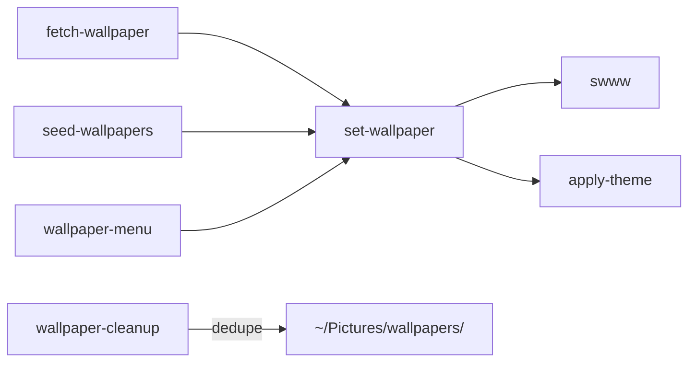

# Scripts

Utility scripts directory — the "glue" of the system.

## Location

`scripts/.local/bin/` → `~/.local/bin/` (20+ scripts)

## By Category

### Audio

| Script | Pattern | Purpose |
|--------|---------|---------|
| `audio-status` | Status | JSON audio state. `--watch` streams via `pactl subscribe` |
| `audio-set` | Action | Mutate audio: volume, mute, default sink/source |
| `audio-menu` | Menu | Wofi UI wrapping status + set |
| `audio-panel` | Action | Toggle Quickshell audio panel, fallback to audio-menu |

### Bluetooth

| Script | Pattern | Purpose |
|--------|---------|---------|
| `bluetooth-status` | Status | JSON BT state. `--watch` via D-Bus |
| `bluetooth-menu` | Menu | Wofi BT device list, falls back to `overskride` |

### Wallpaper Pipeline



| Script | Purpose |
|--------|---------|
| `set-wallpaper` | Entry point: swww + apply-theme, saves state |
| `fetch-wallpaper` | Download random (Unsplash/Picsum), calls set-wallpaper |
| `restore-wallpaper` | Restore on boot, waits for swww-daemon |
| `seed-wallpapers` | Python3: populate ~/Pictures/wallpapers/ (~100 images) |
| `tag-wallpaper-moods` | Python3: OKLab color analysis, cache mood tags |
| `wallpaper-cleanup` | Dedupe by content hash, age-prune (60d default) |
| `wallpaper-control` | Wofi: enable/disable daily timer |
| `wallpaper-menu` | Wofi: pick from local wallpapers |

### Theme & System

| Script | Purpose |
|--------|---------|
| `apply-theme` | pywal colors → all components |
| `reload-desktop` | Restart niri config, quickshell, swaync. `qs` mode chains `pkill qs/quickshell` + `nohup env QT_QPA_PLATFORMTHEME=gtk3 QT_STYLE_OVERRIDE=Fusion qs`. Called by SettingsStore when icon theme changes — kills both process name variants (`qs` and `quickshell`) for reliable restart. Args: `niri`, `quickshell`/`qs`/`bar`, `swaync`, `all` |
| `desktop-menu` | Wofi right-click desktop context menu — reload components, change wallpaper |
| `accent-guardian` | Detect 3+ identical accents in a row |
| `test-theme` | Diagnostics: swww, state, pywal, SDDM |
| `lock-screen` | swaylock-effects with blur |
| `clipboard-manager` | Wofi + cliphist + wl-copy |
| `network-status` | JSON network state via nmcli |
| `network-scan` | JSON wifi scan results |
| `view-logs` | Alacritty tailing log files |
| `sddm-greeter-debug` | Test SDDM greeter in window |
| `test-alacritty.sh` | Validate config, auto-repair duplicates |
| `test-coverage` | Runs bats + kcov, aggregates coverage, compares baseline |

## Design Pattern

**Status** — JSON to stdout:
```bash
#!/usr/bin/env bash
set -euo pipefail
echo '{"sink": "hdmi", "volume": 0.8}'
```

**Action** — mutate state, return exit code:
```bash
#!/usr/bin/env bash
set -euo pipefail
case "${1}" in
    --volume) wpctl set-volume @DEFAULT_SINK@ "${2}" ;;
esac
```

**Menu** — Wofi frontend:
```bash
#!/usr/bin/env bash
set -euo pipefail
choice=$(your_options | wofi --dmenu)
[[ -n "$choice" ]] || exit 1
exec your-action "$choice"
```

## Integration Points

- Quickshell consumes `audio-status`/`bluetooth-status` via Process
- systemd timers run `fetch-wallpaper`, `seed-wallpapers`, `wallpaper-cleanup`
- Niri keybindings run `lock-screen`, `clipboard-manager`
- Wofi used by `audio-menu`, `bluetooth-menu`, `wallpaper-menu`, `clipboard-manager`

## Conventions

- `#!/usr/bin/env bash`, `set -euo pipefail`
- 4-space indent, < 100 chars, quote all vars
- Status scripts emit JSON (machine-parseable first)

## Extending

```bash
vim scripts/.local/bin/your-script
chmod +x scripts/.local/bin/your-script
shellcheck scripts/.local/bin/your-script
shfmt -w -i 4 -ci scripts/.local/bin/your-script
stow -R scripts
# Then update this page
```

> [!WARNING] Updating scripts means you must update this page. See `AGENTS.md` section 11.
