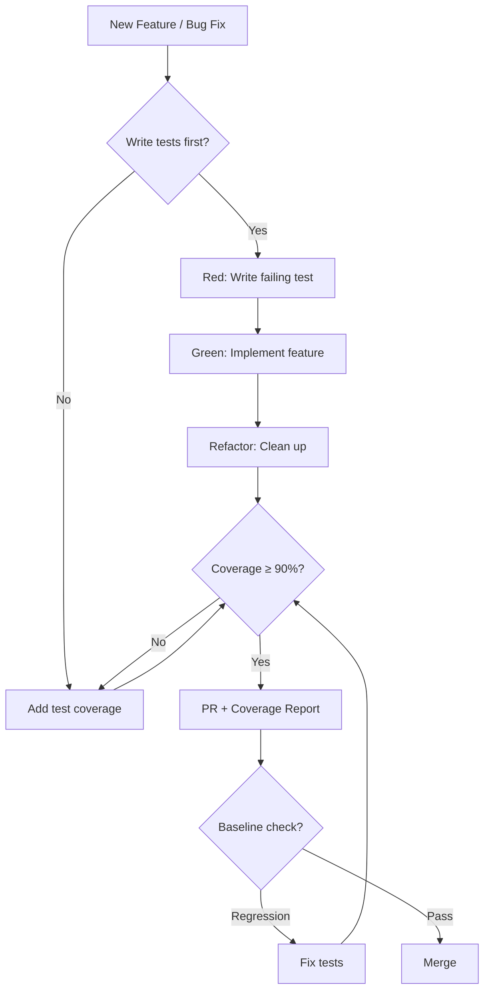
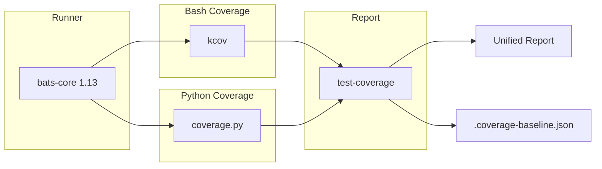
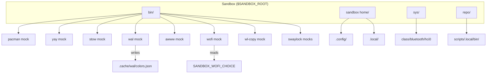
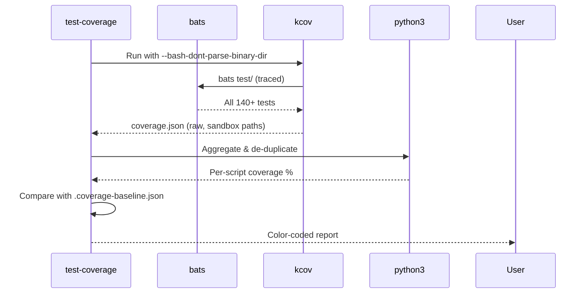
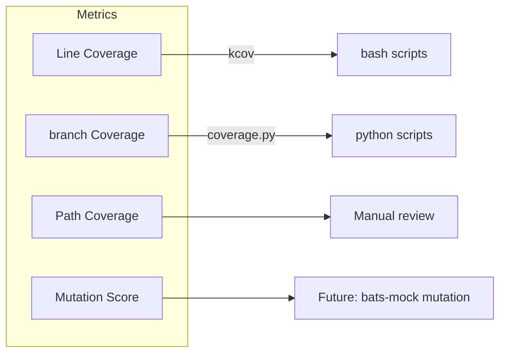

# Testing Standards

> [!IMPORTANT] **Minimum coverage requirement: 90%** on all new/changed code.
> PRs that reduce coverage below baseline or below 90% for new code will not merge.

## Testing Philosophy



### Why 90%?

Not arbitrary. Every script in this repo touches one of these surfaces:

| Surface | Risk if untested |
|---------|-----------------|
| `apply-theme` | Destructive config writes, no rollback |
| `set-wallpaper` | swww state corruption |
| Menu scripts (wofi) | Silent UX failures |
| systemd timers | Fail silently in background |
| Quickshell data scripts | Bar appears broken |

The 10% gap allows for:
- `exec` / `setsid` lines (can't test subprocess manually)
- `tee` log redirections (test output capture handles them)
- `pgrep` / platform-specific checks (mocked where possible)

## Test Framework Stack



## Test File Structure

Every script `scripts/.local/bin/<name>` gets a test at `test/<name>.bats`:

```bash
#!/usr/bin/env bats

setup() {
    source "$BATS_TEST_DIRNAME/helpers.bash"
    create_sandbox

    # ── Arrange ── set up state, mocks, fixtures for this test file
    SCRIPT_UNDER_TEST="$SANDBOX_REPO/scripts/.local/bin/<name>"
}

teardown() {
    cleanup_sandbox
}

# ── Section: Feature ─────────────────────────────────────────────────────────

@test "<name>: specific behavior description" {
    # Arrange
    export SANDBOX_MOCK_CHOICE="expected value"

    # Act
    run bash "$SCRIPT_UNDER_TEST" args

    # Assert
    [ "$status" -eq 0 ]
    grep -q "expected side effect" "$SANDBOX_ROOT/calls.log"
}
```

## Design Patterns for Tests

### Pattern 1: Status Script Testing (JSON output)

Tests verify JSON shape, required keys, value types. Never assert exact values from live hardware.

```bash
@test "script-name: emits valid JSON" {
    run "$SCRIPT"
    [ "$status" -eq 0 ]
    echo "$output" | jq -e . >/dev/null
}

@test "script-name: reports correct type for field" {
    SANDBOX_KNOB=42 run "$SCRIPT"
    [ "$(echo "$output" | jq -r '.field')" = "expected" ]
}
```

### Pattern 2: Action Script Testing (side effects)

Tests verify that the right subcommand is called with the right arguments.

```bash
@test "script-name: action triggers expected side-effect" {
    run "$SCRIPT" action arg
    [ "$status" -eq 0 ]
    grep -q "expected tool arg" "$SANDBOX_ROOT/calls.log"
}
```

### Pattern 3: Menu Script Testing (wofi routing)

Tests simulate wofi selections and verify the dispatched action.

```bash
@test "script-name: selection dispatches correct action" {
    export SANDBOX_WOFI_CHOICE="My Menu Item"
    run bash "$SCRIPT" 2>/dev/null || true
    grep -q "dispatched-action args" "$SANDBOX_ROOT/calls.log"
}
```

> [!WARNING] Wofi mock outputs `$SANDBOX_WOFI_CHOICE` verbatim. The choice must match the **full label** (including icons and markers) as generated by `cut -f3-` from the tab-separated menu lines.

### Pattern 4: Pipeline Script Testing (config generation)

For scripts like `apply-theme` that generate config files:

```bash
@test "apply-theme: generates alacritty config from template" {
    # Arrange: create template + mock upstream tools
    echo '# Template' > "$SANDBOX_HOME/dotfiles/alacritty/template.alacritty.toml"

    # Act
    run bash "$APPLY_THEME" "$WALLPAPER"

    # Assert: config file exists with expected content
    [ -f "$SANDBOX_HOME/.config/alacritty/alacritty.toml" ]
    grep -q 'Template file' "$SANDBOX_HOME/.config/alacritty/alacritty.toml"
    grep -q '[colors.primary]' "$SANDBOX_HOME/.config/alacritty/alacritty.toml"
}
```

## Mock Architecture



### Sandbox Isolation

Every test gets a fresh sandbox:

| Aspect | Isolated by |
|--------|------------|
| `$HOME` | `$SANDBOX_HOME` |
| `$PATH` | `$SANDBOX_ROOT/bin:$PATH` (mocks first) |
| Filesystem | Mock commands act on sandbox paths |
| Bluetooth | `$BT_SYS_DIR` override for adapter detection |
| Audio | Configurable env knobs on mock `pactl`/`wpctl` |

### Mock Knobs

| Env var | Mock | Controls |
|---------|------|---------|
| `SANDBOX_WOFI_CHOICE` | wofi | Value printed to stdout |
| `SANDBOX_BT_AVAILABLE` | bluetoothctl | `yes` → adapter present |
| `SANDBOX_BT_POWERED` | bluetoothctl | `yes` → powered on |
| `SANDBOX_BT_CONNECTED` | bluetoothctl | Space-separated `MAC\|Name` |
| `SANDBOX_SINK_VOLUME` | pactl | 0-150 |
| `SANDBOX_SINK_MUTED` | pactl | `yes`/`no` |
| `SANDBOX_SOURCE_VOLUME` | pactl | 0-150 |
| `SANDBOX_SOURCE_MUTED` | pactl | `yes`/`no` |
| `BT_SYS_DIR` | bluetooth-status | Override `/sys/class/bluetooth/` path |

## Coverage Reporting

```bash
# Full coverage run
test-coverage

# JSON for CI/machine consumption
test-coverage --json

# Check against baseline (exit 1 on regression >2%)
test-coverage --check

# Enforce minimum coverage
test-coverage --threshold 90

# Update baseline after improving coverage
test-coverage --update-baseline
```



## Test Coverage per Script

| Script | Tests | Coverage | Type |
|--------|-------|----------|------|
| `apply-theme` | 17 | ✓ | bash |
| `audio-status` | 7 | 51% | bash |
| `audio-set` | 10 | 83% | bash |
| `audio-menu` | 8 | ✓ | bash |
| `audio-panel` | 2 | ✓ | bash |
| `bluetooth-status` | 4 | 46% | bash |
| `bluetooth-menu` | 5 | ✓ | bash |
| `fetch-wallpaper` | 6 | 33% | bash |
| `set-wallpaper` | 6 | ✓ | bash |
| `restore-wallpaper` | 5 | ✓ | bash |
| `wallpaper-menu` | 3 | ✓ | bash |
| `wallpaper-control` | 6 | ✓ | bash |
| `wallpaper-cleanup` | 6 | ✓ | bash |
| `clipboard-manager` | 4 | ✓ | bash |
| `lock-screen` | 3 | ✓ | bash |
| `network-status` | 6 | ✓ | bash |
| `network-scan` | 5 | ✓ | bash |
| `accent-guardian` | 4 | ✓ | bash |
| `niri-keybind` | 10 | bats | python |
| `tag-wallpaper-moods` | 7 | bats | python |
| `install.sh` | 2 | 54% | bash |
| SDDM theme | 9 | ✓ | qml |
| `sddm-greeter-debug` | 1 | ✓ | bash |
| `test-theme` | 1 | ✓ | bash |
| `view-logs` | 1 | ✓ | bash |

> ✓ = tested but kcov coverage unavailable (Python scripts) or pending kcov run on new tests.

## Writing New Tests

### Checklist

- [ ] New `.bats` file in `test/`
- [ ] Uses `create_sandbox` + existing mocks from `helpers.bash`
- [ ] If new mocks needed, add to `helpers.bash` (not per-test)
- [ ] Test all code paths: success, failure, edge cases, empty input, missing deps
- [ ] Shell variable assertions use `$status`, `$output`, `${lines[@]}`
- [ ] Verify side effects via `$SANDBOX_ROOT/calls.log`
- [ ] Run `bats test/` — all 140+ tests must pass
- [ ] Run `test-coverage --check` — no regressions
- [ ] Run `shellcheck` on the test file (it's still bash)

### Anti-patterns

```bash
# BAD: testing with real system tools
@test "audio" {
    run wpctl status
}

# BAD: testing without sandbox isolation
@test "theme" {
    run apply-theme ~/real/wallpaper.jpg  # writes to real configs!
}

# BAD: testing output that varies by system
@test "network" {
    run nmcli device status
    [[ "$output" =~ "wlp2s0" ]]  # fragile!
}

# GOOD: deterministic mock, no real system impact
@test "network-status: reports wifi type when connected" {
    cat > "$SANDBOX_ROOT/bin/nmcli" <<'EOF'
#!/usr/bin/env bash
echo "wlp2s0:wifi:connected:MyWiFi"
EOF
    run bash "$NETWORK_STATUS"
    [ "$(echo "$output" | jq -r '.type')" = "wifi" ]
}
```

## Test Quality Metrics



### Current Status
- **Bash coverage**: tracked via `test-coverage` + kcov + baseline
- **Python coverage**: pending `coverage.py` integration (Epic 3)
- **Branch coverage**: not tracked (kcov limitation)
- **Mutation testing**: not yet (future enhancement)

## PR Requirements

> [!DANGER] **No PR merges without passing tests and coverage check.**

### Before PR
1. All tests pass: `bats test/`
2. No coverage regression: `test-coverage --check`
3. New code ≥ 90% covered: verify in `test-coverage` output
4. Updated docs per [[#Docs-Update Discipline]]
5. Baseline updated if coverage improved: `test-coverage --update-baseline`

### PR Template

```markdown
## Summary

## Test Plan
- [ ] bats test/ passes
- [ ] test-coverage --check passes
- [ ] New tests added for changed code
- [ ] Docs updated

## Coverage
| Before | After |
|--------|-------|
| XX% | YY% |
```

## Debugging Tests

```bash
# Run a single test with verbose output
bats --verbose-run test/audio-menu.bats

# Run a specific test by name
bats --filter "sink selection" test/audio-menu.bats

# Debug sandbox state (add to test temporarily)
@test "debug" {
    run "$SCRIPT"
    echo "=== calls.log ==="
    cat "$SANDBOX_ROOT/calls.log"
    echo "=== output ==="
    echo "$output"
    false  # force test failure to see output
}
```

## Future Roadmap

- [ ] `coverage.py` for Python scripts (Epic 3)
- [ ] Pre-push hook with coverage check (Epic 4)
- [ ] CI integration with GitHub Actions
- [ ] Mutation testing with `bats-mock` extensions
- [ ] Branch coverage via `kcov --verify-dwarf` (needs debug symbols)
- [ ] Performance regression: track test execution time per file
