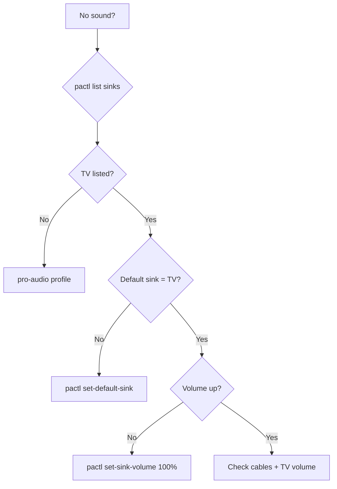

# Workflows

> [!TIP] Check the relevant [[Packages Reference|package note]] for file locations before starting.

## Add a Stow Package

```bash
mkdir -p your-pkg/.config/your-app
vim your-pkg/.config/your-app/config.file
# Add to STOW_DIRS in install.sh
stow -n -v your-pkg    # dry-run
stow -R your-pkg       # apply
# Update docs: Packages Reference.md + Packages/YourPackage.md
```

## Add a Bar Segment (Quickshell)

1. Create `YourSegment.qml` in `quickshell/.config/quickshell/`
2. Add to `Bar.qml` in the appropriate pill section
3. If it needs a popout, wire IPC: `qs.ipc.set("your", yourPopout)`
4. `pkill qs && qs &`
5. Toggle: `qs ipc call your toggle`
6. Update [[Packages/Quickshell]] docs

## Add a Utility Script

```bash
vim scripts/.local/bin/your-script
chmod +x scripts/.local/bin/your-script
shellcheck scripts/.local/bin/your-script
shfmt -w -i 4 -ci scripts/.local/bin/your-script
stow -R scripts
# Optional: bats test/your-script.bats
# Update docs: Packages/Scripts.md
```

Pick a pattern:

```bash
#!/usr/bin/env bash
set -euo pipefail

# Status (JSON to stdout) or Action (mutate state) or Menu (wofi)
case "${1:-}" in
    --action) do_thing;;
    *) echo "Usage: ..." >&2; exit 1;;
esac
```

## Add a Systemd Timer

```ini
# service: systemd/.config/systemd/user/your-task.service
[Unit]
Description=Your task
[Service]
Type=oneshot
ExecStart=%h/.local/bin/your-script
Nice=10
```

```ini
# timer: systemd/.config/systemd/user/your-task.timer
[Unit]
Description=Your task timer
[Timer]
OnCalendar=daily
Persistent=true
RandomizedDelaySec=1800
[Install]
WantedBy=timers.target
```

```bash
ln -s ../your-task.timer systemd/.config/systemd/user/timers.target.wants/
stow -R systemd
systemctl --user daemon-reload
systemctl --user enable --now your-task.timer
# Update docs: Packages/Systemd.md
```

## Extend Theming Pipeline

Add a block to `apply-theme` that writes pywal colors to your component's config. Implement live reload if possible. Test with `set-wallpaper ~/test.jpg`.

## Troubleshooting

### No audio from TV

```bash
pactl list sinks short
pactl set-default-sink <tv-sink-name>
pactl move-sink-input <stream-id> <tv-sink-name>
```

Persist with `~/.config/wireplumber/wireplumber.conf.d/50-tv-default.conf` (sets NVIDIA card to `pro-audio` profile).

### Quickshell not starting

```bash
pkill qs && qs &
journalctl --user -u pipewire --since "5 min ago"
```

### Wallpaper not applying

```bash
test-theme
set-wallpaper ~/Pictures/wallpapers/your-image.jpg
```

## Audio Debug Flowchart


